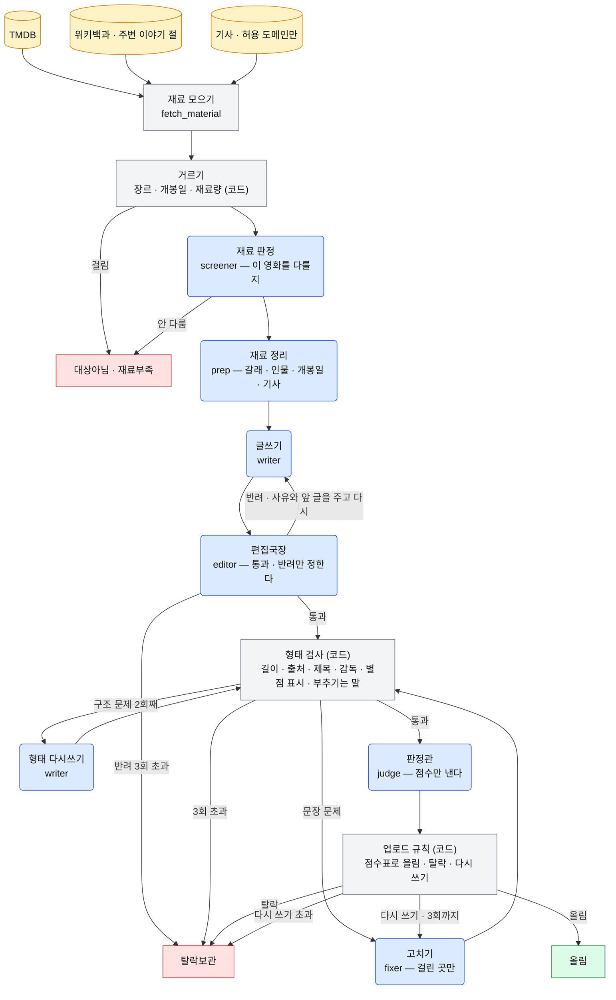
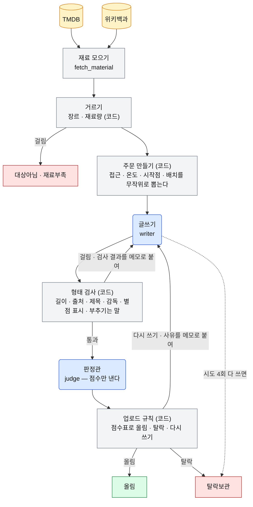
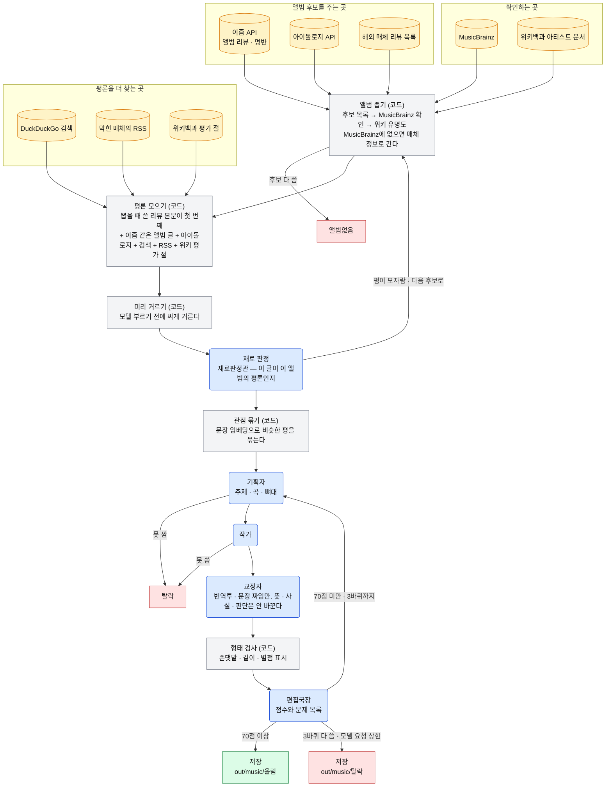
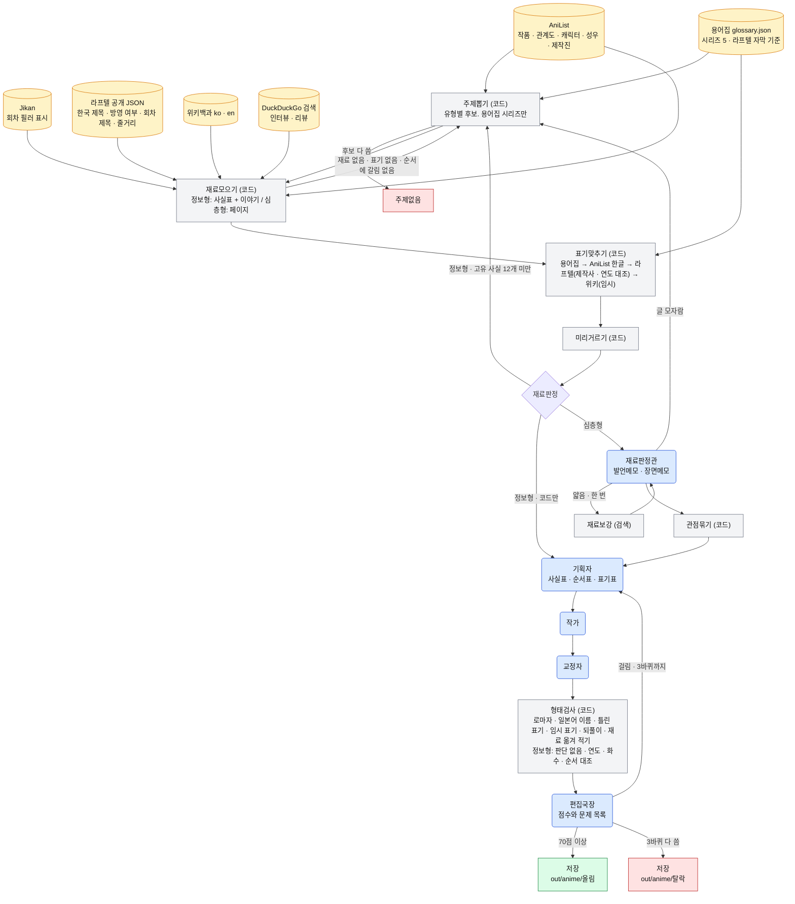
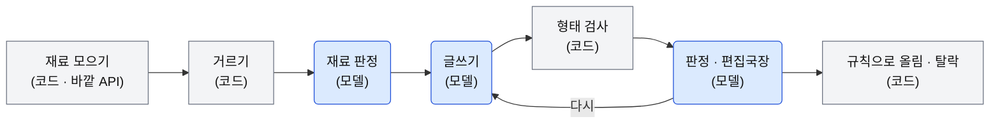

# agent — 콘텐츠 크리에이팅 에이전트

토픽별로 콘텐츠를 만드는 에이전트를 모아 둔다. 공통 뼈대는 pydantic-ai + OpenAI 모델이다.
원본은 Google Colab 노트북이었고, 여기 있는 것은 그것을 스크립트로 옮긴 것이다.

```
agent/
├── requirements.txt        공통 의존성
├── .env.example            키 이름 (LLM_KEY, TMDB_KEY)
├── py2ipynb.py             .py → 콜랩 노트북(.ipynb). 노트북은 여기서 뽑는다. 손으로 안 고친다
├── movie/
│   ├── movie_info_agent.py     영화 · 정보 전달 (V2.3)
│   └── movie_review_agent.py   영화 · 리뷰 (V1.8)
├── music/
│   └── music_review_agent.py   음악 · 리뷰 (v2.9)
├── anime/
│   ├── anime_agent.py          애니 · 유형 다섯 (v0.3)
│   └── glossary.json           애니 용어집 — 시리즈 다섯, 라프텔 자막 기준 (초안)
└── out/                    결과물 (git에 안 올라간다)
```

## 흐름

| 파일 | 토픽 · 유형 | 흐름 |
|---|---|---|
| `movie/movie_info_agent.py` | 영화 · 정보 전달 | 재료 모으기(TMDB + 위키백과 + 기사) → 재료 판정 → 재료 정리 → 글쓰기 → 편집국장 → 형태 검사 → 판정관 → 업로드 규칙 → 고치기 |
| `movie/movie_review_agent.py` | 영화 · 리뷰 | 재료 모으기(TMDB + 위키백과) → 글쓰기 → 형태 검사 → 판정관 → 업로드 규칙 |
| `music/music_review_agent.py` | 음악 · 리뷰 | 앨범 뽑기(이즘 API · 아이돌로지 API · 해외 매체 → MusicBrainz → 위키백과 유명도) → 평론 모으기(뽑은 리뷰 본문 + 이즘 검색 + 아이돌로지 검색 + DuckDuckGo + RSS + 위키 평가 절) → 코드로 거르기 → 재료 판정 → 관점 묶기 → 기획자 → 작가 → 교정자 → 형태 검사 → 편집국장 |
| `anime/anime_agent.py` | 애니 · 유형 다섯 | 주제 뽑기(용어집 시리즈 → AniList 관계도) → 재료 모으기(정보형: AniList · Jikan · 라프텔 · 위키백과 / 심층형: DuckDuckGo 검색 + 위키 평가 절) → 표기 맞추기(코드) → 재료 판정(심층형만 모델) → (관점 묶기) → 기획자 → 작가 → 교정자 → 형태 검사 → 편집국장 |

네 에이전트 모두 마디(node)가 상태 하나를 받아 자기 칸만 채우고 돌려주는 구조다.
갈림길 함수가 다음 마디를 고른다. 한 편에 도는 마디 수와 모델 요청 수에 상한이 있다.

## 구조 그림

세 에이전트의 마디와 갈림길을 코드(`GRAPH` 표 · `produce` 함수)에서 그대로 옮긴 것이다.
읽는 법: 둥근 상자 = 모델을 부르는 마디, 각진 상자 = 코드만 도는 마디, 원통 = 바깥에서 가져오는 재료.
초록 = 올림, 빨강 = 탈락.

### 영화 · 정보 전달 (`movie/movie_info_agent.py`, V2.3)



상한: 한 편에 마디 40개(`MAX_STEPS`), 편집국장 반려 3회, 형태 검사 · 판정관 다시 쓰기 각 3회, 모델 요청은 마디마다 3회.
모델을 부르는 마디는 여섯이다. 재료 판정 · 재료 정리 · 글쓰기 · 편집국장 · 판정관 · 고치기.

### 영화 · 리뷰 (`movie/movie_review_agent.py`, V1.8)



상한: 글쓰기 시도 4회(`MAX_REWRITE` 3 + 첫 번째). 형태 검사에 걸려도 시도 한 번을 쓴다.
모델을 부르는 마디는 둘이다. 글쓰기 · 판정관. 편집국장 · 고치기가 없고, 다시 쓰기는 늘 글쓰기로 돌아간다.

### 음악 · 리뷰 (`music/music_review_agent.py`, v2.7)



상한: 한 편에 마디 60개(`MAX_STEPS`), 다시 쓰기 3바퀴(`REWRITE_LIMIT`), 앨범 하나에 모델 요청 30회(`LLM_CALL_CAP`), 편집국장 통과선 70점(`PASS_SCORE`).
모델을 부르는 마디는 다섯이다. 재료 판정 · 기획자 · 작가 · 교정자 · 편집국장. 앨범 후보 목록을 만들 때 매체 글 제목에서 아티스트 · 앨범을 뽑는 제목파서도 모델을 쓴다.
한국 앨범은 평 1개(`한국최소평`), 해외 앨범은 2개(`MIN_REVIEWS`)가 안 모이면 그 앨범을 버리고 다음 후보로 간다.

### 애니 · 유형 다섯 (`anime/anime_agent.py`, v0.3)

유형은 주문 칸 하나다. 글 모양이 둘로 갈린다. 정보형은 남의 글이 없고 판단을 안 쓴다. 심층형은 인터뷰 · 평론을 재료로 쓴다(음악 v2.9와 같다).

| 유형 | 글 모양 | 재료 | 뽑기 |
|---|---|---|---|
| 사람 — 성우 · 제작진의 참여작 | 정보 | AniList + 라프텔 회차 줄거리(배역이 나오는 회차) + 위키백과 ko 등장인물 | 용어집에 있는 사람 → 한국 표기 있는 참여작 둘 이상 |
| 기념일 — 방영 N주년 · 캐릭터 생일 | 정보 | AniList + 라프텔 회차 줄거리 + 위키백과 ko 줄거리 · 등장인물 · 평가 절 | 오늘 ±7일. 용어집에 있는 캐릭터만 |
| 감상순서 — 순서 · 본편 연결 · 필러 | 정보 | AniList 관계도 + Jikan 회차 표시 + 용어집 편(어디서 어디까지) + 라프텔 회차 제목 · 줄거리 + 위키백과 ko 줄거리 | 순서에 갈림이 있는 시리즈만. 표기 있는 본편 밖 작품 둘 이상, 또는 필러 열 화 이상, 또는 편 셋 이상 |
| 제작이야기 — 감독 · 원작자 인터뷰 | 심층 | 검색(animeanime.jp · ANN 등) + 위키백과 | 시리즈의 최근 TV 작품 |
| 작품리뷰 — 평론 | 심층 | 검색 + 위키백과 ko · en 평가 절 | 시리즈의 최근 TV 작품 |



상한: 마디 60개(`MAX_STEPS`), 다시 쓰기 3바퀴(`REWRITE_LIMIT`), 주제 하나에 모델 요청 40회(`LLM_CALL_CAP`), 편집국장 통과선 70점(`PASS_SCORE`), 한 번 돌 때 같은 시리즈 2편(`작품당상한`).
분량은 유형 다섯 다 1800자 기준, 1500~2000자(`분량기준` · `분량하한` · `분량상한`. PM 결정 2026-09-21).

정보형이 얇은 글을 안 내게 하는 것(v0.2)
• 재료에 이야기가 있어야 한다. 라프텔 회차 목록 API의 회차 제목 · 줄거리(자막 표기 그대로), 위키백과 ko 줄거리 · 등장인물 절, 용어집 편 항목의 "어디서 어디까지". 사실표(연도 · 화수 · 제작사)만으로는 "차례로 보면 된다"밖에 안 나왔다
• 고유 사실이 열둘 아래거나 이야기가 없으면 글을 안 쓰고 주제를 버린다
• 감상순서는 순서에 갈림이 있어야 뽑힌다. 1기 → 2기 → 3기뿐인 프리렌은 안 뽑힌다
• 형태검사가 되풀이(문단 사이 14자 겹침 · 같은 숫자 세 번 · "~하면 된다" 둘)와 재료 옮겨 적기를 잡는다

글이 사람이 쓴 것처럼 읽히게 하는 것(v0.3) — 영화 정보 전달 · 리뷰 에이전트의 프롬프트를 옮겼다
• 쓰는 사람("애니를 오래 많이 본 사람이 쓴다. 설명하지 않고 말한다") · 문체(토막/이음 예시, 판단은 끝까지, 쓰지 않는 말 목록) · 글이 이어지게 쓴다(안 됨/됨 예시) · 네 판단(좋다 · 아깝다를 써도 된다. 왜 그런지가 같은 문장에)
• 정보형도 판단을 쓴다. "판단 없음"으로 못 박았던 네 겹(기획자 · 작가 · 형태검사 · 편집국장)을 지웠다. 부추김 · 근거 없는 센 말 · 남의 평 지어내기만 막는다
• 온도(건조 · 따뜻함 · 짓궂음) · 시작점 8개 · 배치 4개에 뜻이 붙어 있다. 기획자 · 작가 · 편집국장이 같은 주문(낱말 + 뜻)을 받는다. 작품리뷰는 접근(분석 · 해석 · 평가)도 받는다
• 정보형 기획자는 독자의 질문("나루토 720화, 다 봐야 하나")과 답을 먼저 정한다. 문단의 할 말은 관찰 · 계산 · 주장이다. "X편은 N~M화"는 할 말이 아니다
• 편집국장은 주문대로 갔는지 · 읽을 이유 · 표 옮겨 적기 · 답 문단 되풀이를 본다. 재료 밖이지만 널리 알려진 사실은 확인 목록에 적어 넘기고 점수를 안 깎는다
• 문장 · 구조 문제면 작가가 앞 글과 문제 목록을 받아 지적된 부분만 고친다. 사실 문제일 때만 기획자부터 다시 간다
• 형태검사에 표 옮겨 적기 비율 · 화수 범위 개수 · 편 표 문장 · 회차 줄거리 옮기기 · 극장판 화수 · 볼 화수 셈 · 재료 말투 · 글이 자기를 말함 · 질문/답 · 결말 낱말 · 회차 장면 검사. 죽은 글은 19개, 새 프롬프트로 쓴 샘플은 0개 걸린다
• 프롬프트는 워크플로(영화 프롬프트 분석 → 설계 셋 → 심사 셋 → 종합)로 만들었다. 샘플 글: `anime/versions/sample_v0.3_naruto.md`
• `run(목표편수=5)`처럼 유형을 안 주면 다섯 유형을 섞는다
모델을 부르는 마디는 정보형 넷(기획자 · 작가 · 교정자 · 편집국장), 심층형 다섯(+ 재료판정관).

표기 규칙
• `glossary.json`이 첫 번째다. 영화 용어집과 같은 다섯 칸 `[정식 표기, [틀린 표기], [별칭], 종류, 뜻]`. 종류에 기술 · 편 · 제작진을 더했다. 시리즈는 `anilist_root`에서 관계도로 묶는다
• 용어집에 없는 작품 제목은 AniList 한글 별칭 → 라프텔(방영 연도 · 제작사가 AniList와 맞을 때만) 순으로 채운다
• 사람 · 캐릭터 이름은 용어집에 없으면 위키백과 ko로 찾되 "임시"다. 임시 표기와 표기 없는 이름은 글에 못 쓴다. 로마자 · 일본어 이름이 본문에 나오면 형태검사에 걸린다
• 저장 파일 머리에 표기 출처(용어집 / AniList / 라프텔 / 위키 / 없음)를 남긴다. 임시 표기가 쌓이면 사람이 자막과 대조해 용어집에 올린다

### 넷의 공통 뼈대



• 판정하는 모델은 점수나 통과 · 반려만 낸다. 올림 · 탈락은 코드가 정한다.
• 다시 쓰기는 늘 글쓰기(또는 고치기)로 돌아가고, 횟수 상한이 있다.
• 마디 하나는 상태(`RunState`) 하나를 받아 자기 칸만 채우고 돌려준다. 갈림길 함수가 다음 마디 이름을 돌려준다.
• 토픽마다 다른 것은 재료 출처 · 프롬프트 · 통과선 · 마디 개수다. 뼈대는 같다.
• 애니는 유형이 주문 칸으로 들어가고, 갈림길이 글 모양(정보 / 심층)을 보고 관점묶기를 건너뛴다.


## 준비

```bash
cd agent
pip install -r requirements.txt
cp .env.example .env      # 키를 채운다
```

`.env`에 넣는 키

• `LLM_KEY` — OpenAI API 키. 세 에이전트 공통
• `TMDB_KEY` — TMDB API 키. movie/ 두 에이전트

키는 코드에 적지 않는다. `.env` 또는 환경변수로만 읽는다.

## 돌리기

```bash
# 영화 · 정보 전달
python movie/movie_info_agent.py material "프로젝트 헤일메리" 2026   # 재료만 본다
python movie/movie_info_agent.py one "프로젝트 헤일메리" 2026        # 한 편
python movie/movie_info_agent.py released 5                          # 개봉작 무작위 5편
python movie/movie_info_agent.py upcoming 5                          # 개봉 전 무작위 5편

# 영화 · 리뷰
python movie/movie_review_agent.py one "괴물" 2006
python movie/movie_review_agent.py list                 # 테스트 목록 다섯 편
python movie/movie_review_agent.py random 5 --seed 1

# 음악 · 리뷰
python music/music_review_agent.py check                # 이즘 · 아이돌로지 API, 검색 엔진, 해외 매체, RSS 점검. 모델 안 부른다
python music/music_review_agent.py pick --kr --n 3      # 앨범 뽑기 + 재료 모으기까지만. 모델 안 부른다 (--world 는 해외)
python music/music_review_agent.py run --n 5            # 올린 글이 5편 될 때까지 (한국 3 · 해외 2)
python music/music_review_agent.py run --n 3 --kr       # 한국만
python music/music_review_agent.py one 우즈 OO-LI --song Drowning   # 앨범 지정. 곡을 주면 그 곡이 가운데
python music/music_review_agent.py zip

# 애니 · 유형 다섯
python anime/anime_agent.py check                        # AniList · Jikan · 라프텔 · 위키백과 · 검색 점검. 모델 안 부른다
python anime/anime_agent.py glossary                     # 용어집 점검 — 시리즈마다 관계도 · 표기 매칭. 모델 안 부른다
python anime/anime_agent.py pick --type 감상순서 --n 2    # 주제 뽑기 + 재료 모으기까지만. 모델 안 부른다
python anime/anime_agent.py run --n 6                    # 유형 다섯을 섞어 6편. --type 사람 처럼 하나만도 된다. 유형: 사람 · 기념일 · 감상순서 · 제작이야기 · 작품리뷰
python anime/anime_agent.py one 블리치 --type 제작이야기   # 시리즈 지정
python anime/anime_agent.py one "진격의 거인" --type 사람 --person "Hiroshi Kamiya"
python anime/anime_agent.py zip
```

결과는 `agent/out/<이름>/`에 마크다운으로 쌓인다. 여러 편 돌리면 끝에 zip으로도 묶는다.

## 콜랩 노트북

노트북은 `.py`에서 뽑는다. `.py`를 고친 뒤 다시 뽑는다.

```bash
python agent/py2ipynb.py agent/music/music_review_agent.py music_review_agent_v2.9.ipynb
python agent/py2ipynb.py agent/anime/anime_agent.py anime_agent_v0.3.ipynb     # 용어집이 노트북 안에 같이 들어간다
```

첫 셀이 pip 설치와 보안 비밀(`LLM_KEY`) 읽기다. 마지막 셀들이 `점검()` · `뽑기만()` · `run()` · zip 내려받기다.

## 콜랩에서 .py 를 그대로 돌릴 때

```
!pip -q install -r agent/requirements.txt
import os; from google.colab import userdata
os.environ["LLM_KEY"] = userdata.get("LLM_KEY"); os.environ["TMDB_KEY"] = userdata.get("TMDB_KEY")
!python agent/movie/movie_info_agent.py one "프로젝트 헤일메리" 2026
```

## 설정 고치는 곳

각 파일 위쪽 "키와 설정" 자리 하나만 고친다. 모델 이름 · 상한 · 통과선 · 글 길이가 거기 있다.
