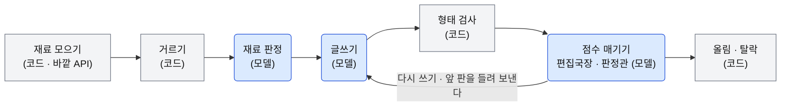
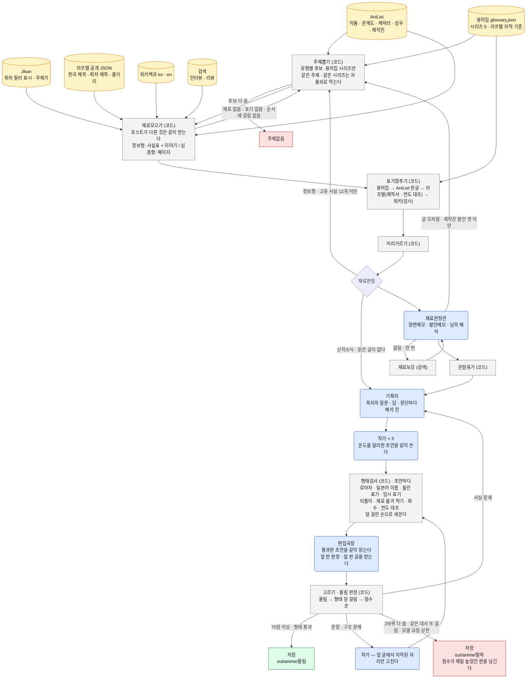
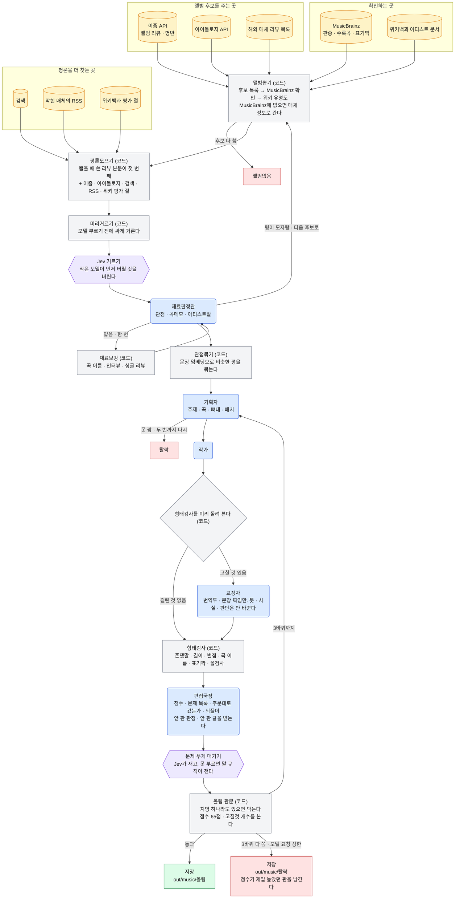
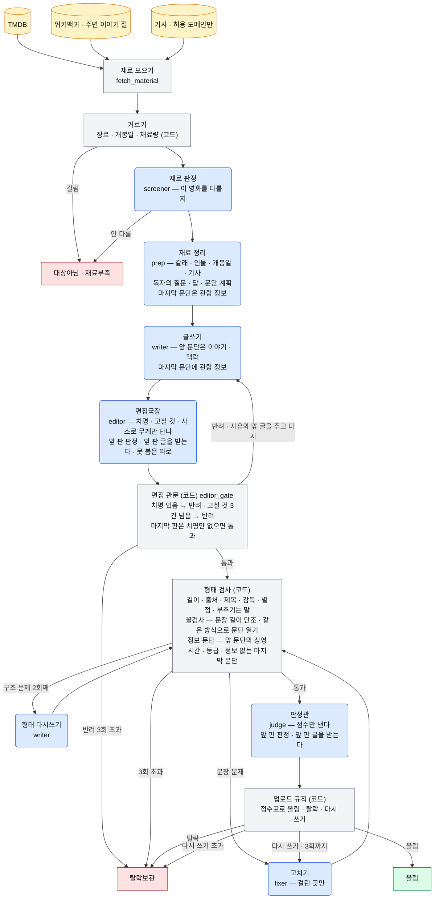
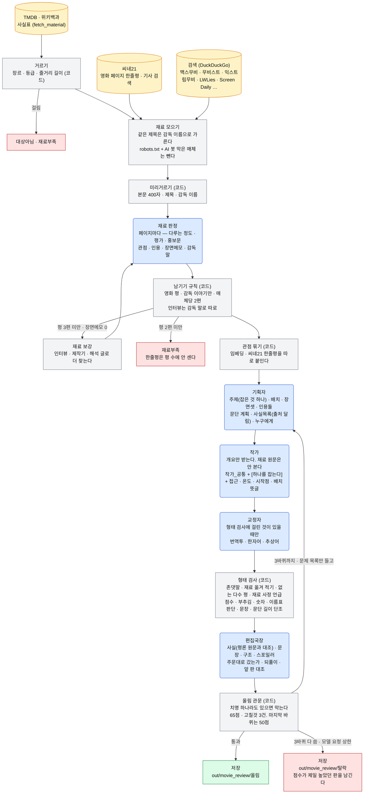
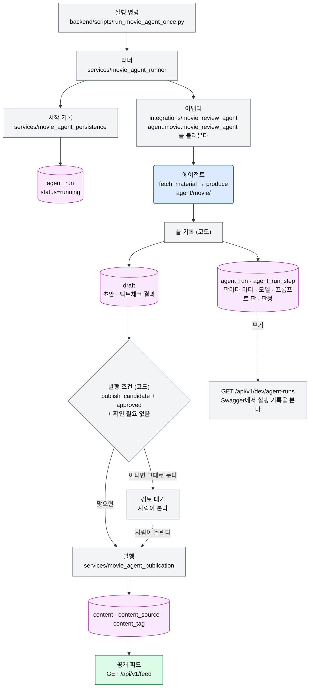

# agent — 콘텐츠 크리에이팅 에이전트

토픽별로 콘텐츠를 만드는 에이전트를 모아 둔다. 공통 뼈대는 pydantic-ai + OpenAI 모델이다.
원본은 Google Colab 노트북이었고, 여기 있는 것은 그것을 스크립트로 옮긴 것이다.

```
agent/
├── requirements.txt        공통 의존성
├── .env.example            키 이름 (LLM_KEY, TMDB_KEY)
├── py2ipynb.py             .py → 콜랩 노트북(.ipynb). 노트북은 여기서 뽑는다. 손으로 안 고친다
├── movie/
│   ├── movie_info_agent.py     영화 · 정보 전달 (V3.3 — 되풀이 · 시제 검사)
│   └── movie_review_agent.py   영화 · 리뷰 (V3.5 — 판단 중심 뼈대 여섯 · 다시 쓰기는 고침 · 되풀이 검사)
├── music/
│   ├── music_review_agent.py   음악 · 리뷰 (v4.4 — 사실 · 옮김 나눔 · 다시 쓰기는 고침 · 되풀이 검사)
│   └── DESIGN.md               음악 설계도 (흐름 · 에이전트 · 앞판기억 · 올림 판정)
├── anime/
│   ├── anime_agent.py          애니 · 유형 넷 (v1.0 — 판정 구조를 셋과 맞춤)
│   └── glossary.json           애니 용어집 — 시리즈 다섯, 라프텔 자막 기준 (초안)
└── out/                    결과물 (git에 안 올라간다)
```

## 흐름

| 파일 | 토픽 · 유형 | 흐름 |
|---|---|---|
| `movie/movie_info_agent.py` | 영화 · 정보 전달 | 재료 모으기(TMDB + 위키백과 + 기사) → 재료 판정 → 재료 정리 → 글쓰기 → 편집국장 → 형태 검사 → 판정관 → 업로드 규칙 → 고치기 |
| `movie/movie_review_agent.py` | 영화 · 리뷰 | 재료 모으기(TMDB + 위키백과 사실표 · 씨네21 한줄평 + 기사 · 검색 매체) → 미리거르기 → 재료 판정 → (재료 보강) → 관점 묶기 → 기획자 → 작가 → 교정자 → 형태 검사 → 편집국장 → 올림 관문 |
| `music/music_review_agent.py` | 음악 · 리뷰 | 앨범 뽑기(이즘 API · 아이돌로지 API · 해외 매체 → MusicBrainz → 위키백과 유명도) → 평론 모으기(뽑은 리뷰 본문 + 이즘 검색 + 아이돌로지 검색 + 검색 + RSS + 위키 평가 절) → 코드로 거르기 → Jev로 거르기 → 재료 판정 → 관점 묶기 → 기획자 → 작가 → 교정자(걸린 것이 있을 때만) → 형태 검사 → 편집국장 → 올림 관문 |
| `anime/anime_agent.py` | 애니 · 유형 여섯 | 주제 뽑기(용어집 시리즈 → AniList 관계도) → 재료 모으기(AniList · Jikan · 라프텔 · 위키백과 + 검색) → 표기 맞추기(코드) → 재료 판정 → (관점 묶기) → 기획자 → 작가 초안 셋 → 형태 검사 → 편집국장 → 고르기. 주제 셋을 같이 돈다 |

네 에이전트 모두 마디(node)가 상태 하나를 받아 자기 칸만 채우고 돌려주는 구조다.
갈림길 함수가 다음 마디를 고른다. 한 편에 도는 마디 수와 모델 요청 수에 상한이 있다.

## LangGraph — 넷 다 옮겼다 (2026-09-28 ~ 29)

PM 결정(9/28): 팀 코드는 전부 LangGraph로 간다. 음악 v4.0 → 영화 리뷰 V3.0 → 애니 v0.8 → 영화 정보 V3.0 순서로 옮겼다.

- 마디 · 갈림길 · 프롬프트 · 재료 · 판정 규칙은 옮기기 전 판 그대로다. `run_graph`가 while 루프 대신 `StateGraph(RunState)`를 짓고 돌린다. 영화 정보는 마디가 async라 `ainvoke`다.
- LangGraph는 조건 엣지 함수가 상태에 쓴 것을 버린다. 우리 갈림길은 상태 · 로그 · 재시도 수를 쓴다.
  그래서 마디 감싸개가 마디 함수 뒤에 갈림길까지 돌리고, 고른 이름을 상태 칸(`다음` · 영화 정보는 `next_node`)에 적는다. 조건 엣지는 그 칸만 읽는다.
- 마디 수 상한 · 마디 실패 · 멈출마디는 `멈춤` 칸에 적고 끝으로 간다(영화 정보는 상한만 있다. 오류는 전처럼 밖으로 올라간다).
- LangGraph는 마디마다 `RunState(**값)`으로 상태를 새로 만든다. dict · list 칸은 얕은 복사가 되고, pydantic 모델 칸(글 · 개요 · 주문)은 같은 것이 넘어간다.
- 옮길 때마다 옛 판(versions/)과 새 판을 같은 경우로 돌려 상태 · 바퀴 · 마디 수 · 기록 · 로그를 비교했다. 음악 9갈래 · 애니 15갈래(스레드 둘 포함) · 영화 정보 15갈래가 전부 같았다. 영화 리뷰는 뼈대를 새로 짜서 비교할 옛 판이 없다. 가짜 모델 9갈래와 `produce()` 모양만 봤다.
- 실제 모델로는 넷 다 아직 안 돌렸다.

## 모델 — 넷 다 같다 (2026-09-24)

`openai:gpt-6-luna`. GPT-6 가 나오면서 같은 자리(가장 싼 층)를 옮겨 탔다. 앞은 `gpt-5.6-luna` 였다.

| | 입력 1M | 캐시 입력 | 출력 1M | 지식 기준일 |
|---|---|---|---|---|
| gpt-5.6-luna (앞) | $0.20 | $0.02 | $1.20 | 2026-02-16 |
| **gpt-6-luna (지금)** | **$0.10** | **$0.01** | **$0.50** | **2026-05-18** |

- 맥락 창 105만 토큰 · 함수 호출 · 구조화 출력은 같다. 한 편 값은 절반 아래로 떨어진다.
- `"openai:"` 접두어는 pydantic-ai 2.x 에서 Responses API 로 간다. 이 모델은 chat completions 에서 `reasoning_effort` 를 `none` 으로 둘 때만 함수 호출이 된다(OpenAI 문서). 그래서 Responses API 로 가야 한다. 애니 `_새모델()` 도 `OpenAIResponsesModel` 이다.
- 고치는 곳은 파일마다 `MODEL` 한 줄이다. 글이 나빠지면 그 줄만 되돌린다.
- 글 품질이 어떻게 달라지는지는 아직 안 봤다.

## 애니 v1.0 — 판정 구조를 셋과 맞춘다 (2026-09-29, PM)

9/29 실측에서 애니는 15번 시도에 1편만 올라갔다($0.357). 형태 검사 하나만 걸려도 탈락했고, 초안 셋 중 둘을 읽지 않고 버렸다.
- 형태 검사 치명 · 고칠 것 나눔(치명: 존댓말 · 원문 남음 · 표기 틀림 · 재료에 없는 연도/화수 · 결말 · 없는 반응 · 재료 옮겨 적기 · 되풀이 · 분량 크게 모자람)
- 첫 문단 질문 · 마지막 문단 답은 경고로 · 초안 하나 · 다시 쓰기는 고침 + 되돌리기(3바퀴) · 재료가 얇은 주제는 모델 판정 전에 버림
- 통과선(편집국장 70점)과 사실 문제는 그대로 막는다

## 같은 말 되풀이 · 시제 — 코드가 무조건 잡는다 (2026-09-29, PM)

편집국장이 고칠 것 3건까지 넘기면서 같은 문장이 네 번 나온 글이 올라갔다. 그래서 되풀이는 코드(`되풀이검사`)가 잡는다. 영화 정보 V3.3 · 음악 v4.4 · 영화 리뷰 V3.5에 들어 있다. 애니는 그대로다.
- 새 말이 없는 문장: 뜻 있는 낱말(앞 두 글자 줄기) 넷 이상 중 80% 넘게가 앞 문장들에 이미 나왔다
- 같은 말 세 번: 고유명사가 아닌 한글 어절 셋이 같은 차례로 세 문장 넘게 나온다
- 영화 정보는 형태 검사로, 음악 · 리뷰는 형태 치명으로 건다. 고쳐지지 않으면 올라가지 않는다.
영화 정보는 이미 개봉한 영화를 '걸린다' · '관객을 만난다'로 쓰면 잡는다. 재개봉은 한국 개봉 기록이 그 전에도 있을 때만이다.

## 주문 어김 — 반려 · 감점 사유가 아니다 (2026-09-29, PM)

온도 · 시작점 · 배치(리뷰는 접근도)는 글마다 무작위로 뽑는다. 서로 부딪치는 조합(상황부터 + 사실 먼저 같은 것)이 나오면 작가는 하나를 어길 수밖에 없다.
그래서 네 에이전트 모두 주문 어김으로는 글을 떨어뜨리지 않는다. 영화 정보 V3.2는 편집국장이 사소에 적고 판정관이 안 깎는다. 영화 리뷰 V3.1 · 음악 v4.1 · 애니 v0.9는 편집국장이 종류 `주문`으로 적고 코드가 사소로 센다(점수 안 깎음). 작가는 주문을 그대로 받는다.

음악 v4.2(9/29, PM): 원문 평을 좁히거나 세게 옮긴 것은 치명 `사실`이 아니라 고칠것 `옮김`이다. 탈락은 없는 사실 · 뜻이 반대 · 틀린 이름이나 숫자 · 들어야 아는 것만.

## 다시 쓰기는 고침이다 — 음악 v4.3 · 영화 리뷰 V3.2 (2026-09-29, PM)

9/29 실측에서 다시 쓸 때마다 점수가 오르지 않았다. 음악은 다시 쓴 11번 중 8번 내려갔다(86 → 82 → 79). 편집국장이 걸면 기획자부터 새로 써서 새 문제가 생겼다.
이제 두 에이전트는 떨어진 글을 `고치기` 마디가 받아 지적된 자리만 고친다(영화 정보처럼). 고친 판이 최고 판보다 낮으면 다음 고치기는 최고 판 글에서 시작한다(되돌리기).
흐름: 편집국장(탈락) → 고치기 → 교정자 → 형태 검사 → 편집국장. 애니는 PM 결정으로 그대로 둔다.

## 앞 판 기억 — 넷이 같은 방식 (2026-09-22)

글이 걸려서 다시 쓰면, 점수를 내는 쪽(음악 · 애니 · 영화 리뷰는 편집국장, 영화 정보는 편집국장 + 판정관)이 앞 판을 받고 채점한다.
전에는 판마다 처음 보는 것처럼 채점해서 같은 글을 고쳐도 점수가 흔들렸다. 올랐는지 내렸는지 판단할 근거가 없었다.

- 받는 것: `[앞 판 판정]`(점수 · 문제 목록 · 형태검사 걸림 · 한줄평) + `[앞 판 글]`(제목 · 본문) + `[이번 글 — N차 · 판 종류]`. 채점하는 것은 이번 글이다. 앞 판 글은 대조용이다.
- 판 종류 셋: 첫 판 / 고침(앞 글을 받아 지적된 자리만 손본 것) / 새로 씀(앞 판 문제 목록만 받고 처음부터 다시 쓴 것). 코드가 정한다. 음악은 편집국장이 걸면 기획자부터 가므로 새로 씀뿐이다.
- 내는 것: 앞 판 문제마다 `고쳐짐 / 남음 / 새로 생김 / 앞 판에서 못 봄` 한 줄(앞판대조 · `compared`) + 점수설명 한 줄(`점수설명` · `score_note`).
  "새로 생김"은 글이 나빠진 것이고, "못 봄"은 앞 판 글에도 있었는데 앞 판이 안 잡은 것이다. 못 봄만으로는 점수를 안 내린다.
- 점수 규칙: 앞 점수에서 출발한다. 고쳐진 게 있고 새로 생긴 문제가 없으면 앞 점수 아래로 안 준다. 내리면 점수설명에 어느 문제 때문인지 적는다. 영화 정보 편집국장은 점수가 없어 고쳐짐 / 남음 대조만 한다.
- 로그: `앞 판 62점 → 71점 / 고쳐짐 2 · 남음 1 · 새로 생김 0 · 못 봄 0`. 저장 파일의 판정 기록에 판마다 종류 · 점수 · 앞 판 대비 · 대조 줄이 남는다.
- 최고 판 저장: 마지막 판이 탈락이면 기록 중 점수(영화는 합계)가 제일 높은 판의 글을 저장한다. 다시 쓰다 나빠진 글이 남지 않게 한다.
- 설정값: 음악 · 애니 · 영화 리뷰 `앞판기억` · `최고판저장`, 영화 정보 `REMEMBER_PREVIOUS` · `KEEP_BEST_ROUND`. False면 전과 같다.

## 글의 꼴 — 음악 v3.5 · 영화 정보 V2.5 · 영화 리뷰 V2.0 (2026-09-22. 리뷰 V3.0도 같은 프롬프트를 들고 갔다)

글이 단조롭다는 지적에 애니 v0.3에서 고친 방식을 음악에 옮기고, 영화 둘에도 같은 방식을 넣었다.

- 온도 · 시작점 · 배치 · 접근을 낱말이 아니라 뜻글로 준다(`온도글` · `시작점글` · `배치글` · `접근글` · `주문_text`). 기획자 · 작가 · 편집국장이 같은 [주문]을 받는다.
- 작가가 `작가_공통`(쓰는 사람 · 문체 · 글이 이어지게 · 문단 여는 법 · 네 판단 · 숫자)을 받는다. 비유는 허용한다.
- 편집국장이 [주문대로 갔는가] · [되풀이 — 글의 꼴](같은 꼴 문단 · 같은 길이 문장 · 같은 방식으로 문단 열기)을 본다.
- 형태검사(코드) `꼴검사`: 문장 길이 단조 · 곡 이름으로 문단 열기 3번 · 아티스트 표기 섞임 · 곡 표기 병기 없음.
- 표기표: 아티스트 대표 표기는 앨범 정보의 이름(MusicBrainz 이름)이고 다른 표기는 첫 등장에 괄호로 한 번(`WOODZ(우즈)`). 곡은 MusicBrainz 릴리즈 여럿의 제목을 모아 짝을 만든다(`곡짝`: `심연(ABYSS)`). 편집국장은 짝 안의 표기를 사실 문제로 안 잡는다.
- `run`은 편마다 접근 · 온도 · 시작점을 돌려 쓰고(`조건돌려쓰기`), 기획자에게 앞 두 편의 배치를 피하라고 알려 준다. 같은 앨범을 다시 쓸 때는 조건을 안 바꾼다.

영화 둘(V2.5 · V2.0)

- 온도 · 시작점 · 배치(리뷰는 접근도)를 뜻글로. 작가 · 편집국장 · 판정관이 같은 [주문]을 받는다(`order_text`). 작가 규칙에 같은 꼴 문장 금지 · 문단 여는 법 · 비유 허용.
- 정보 전달: 재료 정리(prep)가 독자의 질문 · 답 · 문단 계획(`question` · `answer` · `plan`)을 낸다. 작가는 첫 문단에 질문, 마지막 문단에 답. 정보 전달은 "요소 넷을 채우는 글"에서 "독자의 정보 질문 하나에 답하면서 넷이 나오는 글"이 됐다. 기획자 마디는 안 만들었다.
- 리뷰: [하나를 잡는다] — 장면 · 선택 · 인물 하나를 끝까지 끌고 가고 다섯 요소는 그 하나를 지나가며 나온다. 판단을 이름표로 다는 문장("가장 큰 힘이다", "힘은 분명하다")을 안 쓴다.
- 편집국장(정보)이 [주문대로 갔는가] · [독자의 질문] · [되풀이 — 글의 꼴]을 본다. 판정관(둘 다) "글 완성도"에서 같은 꼴 문단 · 문장 길이 단조 · 주문 어김을 깎는다.
- 형태검사(코드) `shape_form_check`: 문장 길이 단조 · 영화 제목/"이 영화"로 문단 열기 3번. 정보는 출연진 · 상영시간 · 등급 몰림과 `(목소리: 미상)` 괄호. 리뷰는 문단 길이 단조와 이름표 판단.

## 구조 그림

네 에이전트의 마디와 갈림길을 코드(`GRAPH` 표 · `produce` 함수)에서 그대로 옮긴 것이다. 마지막으로 코드와 맞춘 날은 2026-09-28이다.

읽는 법
• 둥근 상자 = 모델을 부르는 마디
• 각진 상자 = 코드만 도는 마디
• 원통 = 바깥에서 가져오는 재료
• 초록 = 올림, 빨강 = 탈락

### 넷의 공통 뼈대

토픽이 달라도 순서는 같다. 다른 것은 재료 출처 · 프롬프트 · 통과선 · 마디 개수다.


```mermaid
flowchart LR
    classDef llm  fill:#dbeafe,stroke:#1d4ed8,color:#111
    classDef code fill:#f3f4f6,stroke:#6b7280,color:#111

    A["재료 모으기<br/>(코드 · 바깥 API)"]:::code --> B["거르기<br/>(코드)"]:::code
    B --> C("재료 판정<br/>(모델)"):::llm
    C --> D("글쓰기<br/>(모델)"):::llm
    D --> E["형태 검사<br/>(코드)"]:::code
    E --> F("점수 매기기<br/>편집국장 · 판정관 (모델)"):::llm
    F -->|다시 쓰기 · 앞 판을 들려 보낸다| D
    F --> G["올림 · 탈락<br/>(코드)"]:::code
```

• 점수를 내는 모델은 점수나 통과 · 반려만 낸다. 올림 · 탈락은 코드가 정한다.
• 다시 쓰기는 늘 글쓰기(또는 고치기)로 돌아가고, 횟수 상한이 있다.
• 마디 하나는 상태(`RunState`) 하나를 받아 자기 칸만 채우고 돌려준다. 갈림길 함수가 다음 마디 이름을 돌려준다.
• 앞판기억 — 점수를 내는 쪽이 앞 판 판정 · 앞 판 글 · 이번 판 종류(첫 판 / 고침 / 새로 씀)를 같이 받는다. 문제마다 고쳐짐 · 남음 · 새로 생김 · 못 봄을 적는다.
• 최고판저장 — 마지막 판이 탈락이면 점수가 제일 높았던 판의 글을 남긴다.
• 글이 단조로워지지 않게 온도 · 시작점 · 배치(리뷰는 접근도)를 뜻글로 준다. 글을 쓰는 쪽과 읽는 쪽이 같은 [주문]을 받는다.

### 애니 (`anime/anime_agent.py`, v1.0 — 유형 여섯 중 넷을 쓴다. 감상순서 · 기념일은 9/29에 뺐다)

유형은 주문 칸 하나다. 글 모양이 둘로 갈린다. 정보형은 사실표와 이야기로 쓰고, 심층형은 인터뷰 · 평론을 재료로 쓴다.

| 유형 | 글 모양 | 재료 | 뽑기 |
|---|---|---|---|
| 사람 — 성우 · 제작진의 참여작 | 정보 | AniList + 라프텔 회차 줄거리(배역이 나오는 회차) + 위키백과 ko 등장인물 + 검색 | 용어집에 있는 사람 → 한국 표기 있는 참여작 둘 이상 |
| 기념일 — 방영 N주년 · 캐릭터 생일 | 정보 | AniList + 라프텔 회차 줄거리 + 위키백과 ko 줄거리 · 등장인물 | 오늘 ±7일. 용어집에 있는 캐릭터만. v0.4부터 `run`에서 뺐다(`유형비율` 0). `run_one`으로는 된다 |
| 감상순서 — 순서 · 본편 연결 · 필러 | 정보 | AniList 관계도 + Jikan 회차 표시 + 용어집 편 + 라프텔 회차 제목 · 줄거리 + 위키백과 ko + 검색 | 순서에 갈림이 있는 시리즈만. 본편 밖 작품 둘 이상, 또는 필러 열 화 이상, 또는 편 셋 이상 |
| 신작소식 — 방영 전 · 막 시작한 작품 (v0.7) | 정보 | AniList(방영일 · 분기 · 화수 · 제작사 · 제작진 · 원작) + 전작 라프텔 회차(끝 직전 여덟 화에서 마지막 둘은 뺀다) + Jikan 주제가 + 위키백과 | 용어집 시리즈 안에서 방영 시작이 앞 120일 ~ 뒤 300일. 전작 표기가 확정된 것만. 검색은 안 한다(방영 전이라 글이 없다) |
| 제작이야기 — 감독 · 원작자 인터뷰 | 심층 | 검색(animeanime.jp · ANN 등) + 위키백과 + 회차 줄거리 | 시리즈의 최근 TV 작품. 제작진 발언 셋 이상 |
| 작품리뷰 — 평론 | 심층 | 검색 + 위키백과 ko · en 평가 절 + 회차 줄거리 | 시리즈의 최근 TV 작품 |


```mermaid
flowchart TD
    classDef llm  fill:#dbeafe,stroke:#1d4ed8,color:#111
    classDef code fill:#f3f4f6,stroke:#6b7280,color:#111
    classDef src  fill:#fef3c7,stroke:#d97706,color:#111
    classDef ok   fill:#dcfce7,stroke:#15803d,color:#111
    classDef drop fill:#fee2e2,stroke:#b91c1c,color:#111

    GL[("용어집 glossary.json<br/>시리즈 5 · 라프텔 자막 기준")]:::src
    AL[("AniList<br/>작품 · 관계도 · 캐릭터 · 성우 · 제작진")]:::src
    JK[("Jikan<br/>회차 필러 표시 · 주제가")]:::src
    LF[("라프텔 공개 JSON<br/>한국 제목 · 회차 제목 · 줄거리")]:::src
    WK[("위키백과 ko · en")]:::src
    DDG[("검색<br/>인터뷰 · 리뷰")]:::src

    GL --> P
    AL --> P
    P["주제뽑기 (코드)<br/>유형별 후보. 용어집 시리즈만<br/>같은 주제 · 같은 시리즈는 자물쇠로 막는다"]:::code
    P -->|후보 다 씀| X0[주제없음]:::drop
    P --> M["재료모으기 (코드)<br/>호스트가 다른 것은 같이 받는다<br/>정보형: 사실표 + 이야기 / 심층형: 페이지"]:::code
    AL --> M
    JK --> M
    LF --> M
    WK --> M
    DDG --> M
    M -->|재료 없음 · 표기 없음 · 순서에 갈림 없음| P
    M --> T["표기맞추기 (코드)<br/>용어집 → AniList 한글 → 라프텔(제작사 · 연도 대조) → 위키(임시)"]:::code
    GL --> T
    T --> F["미리거르기 (코드)"]:::code
    F --> J{"재료판정"}
    J -->|정보형 · 고유 사실 12개 미만| P
    J -->|신작소식 · 읽은 글이 없다| PL
    J --> MJ("재료판정관<br/>장면메모 · 발언메모 · 남의 해석"):::llm
    MJ -->|얇음 · 한 번| RB["재료보강 (검색)"]:::code
    RB --> MJ
    MJ -->|글 모자람 · 제작진 발언 셋 미만| P
    MJ --> CL["관점묶기 (코드)"]:::code
    CL --> PL("기획자<br/>독자의 질문 · 답 · 문단마다 해석 칸"):::llm
    PL --> WR("작가 × 3<br/>온도를 달리한 초안을 같이 쓴다"):::llm
    WR --> SH["형태검사 (코드) · 초안마다<br/>로마자 · 일본어 이름 · 틀린 표기 · 임시 표기<br/>되풀이 · 재료 옮겨 적기 · 화수 · 연도 대조<br/>덜 걸린 순으로 세운다"]:::code
    SH --> ED("편집국장<br/>통과한 초안을 같이 읽는다<br/>앞 판 판정 · 앞 판 글을 받는다"):::llm
    ED --> GT["고르기 · 올림 판정 (코드)<br/>올림 → 형태 덜 걸림 → 점수 순"]:::code
    GT -->|70점 이상 · 형태 통과| OK["저장<br/>out/anime/올림"]:::ok
    GT -->|문장 · 구조 문제| WR2("작가 — 앞 글에서 지적된 자리만 고친다"):::llm
    GT -->|사실 문제| PL
    WR2 --> SH
    GT -->|2바퀴 다 씀 · 같은 데서 또 걸림 · 모델 요청 상한| X2["저장<br/>out/anime/탈락<br/>점수가 제일 높았던 판을 남긴다"]:::drop
```

상한 — 마디 60개(`MAX_STEPS`), 바퀴 2회(`REWRITE_LIMIT`), 주제 하나에 모델 요청 48회(`LLM_CALL_CAP`), 통과선 70점(`PASS_SCORE`), 한 번 돌 때 같은 시리즈 2편(`작품당상한`), 한 번 돌 때 주제 18개(`시도상한`).
분량은 유형 여섯 다 1800자 기준, 1500~2000자(`분량기준` · `분량하한` · `분량상한`. PM 결정 2026-09-21).

한 번에 여러 편 (v0.5)
• `run(목표편수=6)`은 주제를 세 개씩(`동시주제`) 스레드로 같이 돈다. `run(목표편수=6, 동시=1)`이면 한 줄로 돈다.
• 스레드마다 이벤트 루프와 모델을 따로 만든다(`_새모델()`). 클라이언트 하나를 루프 여럿이 나눠 쓰면 터진다.
• AniList 2초 · 라프텔 · 위키는 호스트별 간격 자물쇠가 있다. 그만큼은 줄을 선다.
• 첫 바퀴에 작가가 초안 셋을 온도(건조 · 따뜻함 · 짓궂음)를 달리해 같이 쓴다(`초안수`). 형태검사는 코드라 공짜로 셋을 다 보고, 통과한 것만 편집국장이 읽는다.
• 교정자 마디는 건너뛴다(`교정자쓰기` False). 교정 규칙이 작가 프롬프트 끝에 붙어 있다.
• 같은 종류로 두 바퀴 연속 걸리면 세 번째를 안 돈다(`같은걸림중단` · `같은걸림개수` 3).
• 모델을 부르는 마디는 정보형 셋(기획자 · 작가 · 편집국장), 심층형 넷(+ 재료판정관)이다. 정보형도 검색해 읽은 글은 재료판정관이 본다(`정보형검색`).

표기 규칙
• `glossary.json`이 첫 번째다. 영화 용어집과 같은 다섯 칸 `[정식 표기, [틀린 표기], [별칭], 종류, 뜻]`. 종류에 기술 · 편 · 제작진을 더했다. 시리즈는 `anilist_root`에서 관계도로 묶는다.
• 용어집에 없는 작품 제목은 AniList 한글 별칭 → 라프텔(방영 연도 · 제작사가 AniList와 맞을 때만) 순으로 채운다.
• 사람 · 캐릭터 이름은 용어집에 없으면 위키백과 ko로 찾되 "임시"다. 임시 표기와 표기 없는 이름은 글에 못 쓴다. 로마자 · 일본어 이름이 본문에 나오면 형태검사에 걸린다.
• 저장 파일 머리에 표기 출처(용어집 / AniList / 라프텔 / 위키 / 없음)를 남긴다. 임시 표기가 쌓이면 사람이 자막과 대조해 용어집에 올린다.

### 음악 · 리뷰 (`music/music_review_agent.py`, v4.4)


```mermaid
flowchart TD
    classDef llm  fill:#dbeafe,stroke:#1d4ed8,color:#111
    classDef code fill:#f3f4f6,stroke:#6b7280,color:#111
    classDef src  fill:#fef3c7,stroke:#d97706,color:#111
    classDef ok   fill:#dcfce7,stroke:#15803d,color:#111
    classDef drop fill:#fee2e2,stroke:#b91c1c,color:#111
    classDef jev  fill:#ede9fe,stroke:#6d28d9,color:#111

    subgraph S1["앨범 후보를 주는 곳"]
        IZM[("이즘 API<br/>앨범 리뷰 · 명반")]:::src
        IDO[("아이돌로지 API")]:::src
        FOR[("해외 매체 리뷰 목록")]:::src
    end
    subgraph S2["확인하는 곳"]
        MB[("MusicBrainz<br/>판종 · 수록곡 · 표기짝")]:::src
        WK[("위키백과 아티스트 문서")]:::src
    end
    subgraph S3["평론을 더 찾는 곳"]
        DDG[("검색")]:::src
        RSS[("막힌 매체의 RSS")]:::src
        WR2[("위키백과 평가 절")]:::src
    end

    IZM --> A
    IDO --> A
    FOR --> A
    MB --> A
    WK --> A
    A["앨범뽑기 (코드)<br/>후보 목록 → MusicBrainz 확인 → 위키 유명도<br/>MusicBrainz에 없으면 매체 정보로 간다"]:::code
    A -->|후보 다 씀| X0[앨범없음]:::drop
    A --> C["평론모으기 (코드)<br/>뽑을 때 쓴 리뷰 본문이 첫 번째<br/>+ 이즘 · 아이돌로지 · 검색 · RSS · 위키 평가 절"]:::code
    DDG --> C
    RSS --> C
    WR2 --> C
    C --> PF["미리거르기 (코드)<br/>모델 부르기 전에 싸게 거른다"]:::code
    PF --> JV{{"Jev 거르기<br/>작은 모델이 먼저 버릴 것을 버린다"}}:::jev
    JV --> MJ("재료판정관<br/>관점 · 곡메모 · 아티스트말"):::llm
    MJ -->|얇음 · 한 번| RB["재료보강 (코드)<br/>곡 이름 · 인터뷰 · 싱글 리뷰"]:::code
    RB --> MJ
    MJ -->|평이 모자람 · 다음 후보로| A
    MJ --> CL["관점묶기 (코드)<br/>문장 임베딩으로 비슷한 평을 묶는다"]:::code
    CL --> PL("기획자<br/>주제 · 곡 · 뼈대 · 배치"):::llm
    PL -->|못 짬 · 두 번까지 다시| X1[탈락]:::drop
    PL --> WR("작가"):::llm
    WR --> PRQ{"형태검사를 미리 돌려 본다 (코드)"}:::code
    PRQ -->|걸린 것 없음| SH
    PRQ -->|고칠 것 있음| PR("교정자<br/>번역투 · 문장 짜임만. 뜻 · 사실 · 판단은 안 바꾼다"):::llm
    PR --> SH["형태검사 (코드)<br/>존댓말 · 길이 · 별점 · 곡 이름 · 표기짝 · 꼴검사"]:::code
    SH --> ED("편집국장<br/>점수 · 문제 목록 · 주문대로 갔는가 · 되풀이<br/>앞 판 판정 · 앞 판 글을 받는다"):::llm
    ED --> WT{{"문제 무게 매기기<br/>Jev가 재고, 못 부르면 말 규칙이 잰다"}}:::jev
    WT --> GT["올림 관문 (코드)<br/>치명 하나라도 있으면 막는다<br/>점수 65점 · 고칠것 개수를 본다"]:::code
    GT -->|통과| OK["저장<br/>out/music/올림"]:::ok
    GT -->|3바퀴까지| PL
    GT -->|3바퀴 다 씀 · 모델 요청 상한| X2["저장<br/>out/music/탈락<br/>점수가 제일 높았던 판을 남긴다"]:::drop
```

v4.0에서 마디 · 갈림길 · 프롬프트 · 재료 · 판정 규칙은 그대로다. `run_graph`가 while 루프 대신 LangGraph `StateGraph`를 짓고 돌린다(PM 9/28 결정 — 팀 코드 전부 LangGraph). 그래서 그림은 v3.5와 같다.

상한 — 마디 60개(`MAX_STEPS`), 다시 쓰기 3바퀴(`REWRITE_LIMIT`), 앨범 하나에 모델 요청 40회(`LLM_CALL_CAP`), 통과선 65점(`PASS_SCORE`), 마지막 바퀴는 기준을 낮춘다(`마지막안전점수`).
한국 앨범은 평 1개(`한국최소평`), 해외 앨범은 2개(`MIN_REVIEWS`)가 안 모이면 그 앨범을 버리고 다음 후보로 간다.

이 그림에만 있는 것
• 보라색 상자 둘이 Jev(작은 모델)다. 재료를 싸게 거르는 자리와 편집국장 문제에 무게를 매기는 자리에 있다. 키가 없거나 세 번 연달아 실패하면 스스로 꺼지고, 말 규칙이 무게를 대신 잰다.
• 올림 관문은 문제를 셋으로 나눈다. 치명 · 고칠것 · 사소다. 치명만 글을 막는다. 표기 문제는 사소로 내린다.
• 교정자는 늘 부르지 않는다. 형태검사를 먼저 공짜로 돌려 보고 걸린 것이 있을 때만 부른다. 글 전체를 다시 쓰는 마디라 30~60초가 든다.
• `run`은 편마다 접근 · 온도 · 시작점을 돌려 쓰고(`조건돌려쓰기`), 기획자에게 앞 두 편의 배치를 피하라고 알려 준다.
• 앨범 후보 목록을 만들 때 매체 글 제목에서 아티스트 · 앨범을 뽑는 제목파서도 모델을 쓴다.
• `동시앨범`은 기본 1이다. 올리면 앨범 여러 편을 스레드로 같이 돈다.

### 영화 · 정보 전달 (`movie/movie_info_agent.py`, V3.3 — 2026-09-29)


```mermaid
flowchart TD
    classDef llm  fill:#dbeafe,stroke:#1d4ed8,color:#111
    classDef code fill:#f3f4f6,stroke:#6b7280,color:#111
    classDef src  fill:#fef3c7,stroke:#d97706,color:#111
    classDef ok   fill:#dcfce7,stroke:#15803d,color:#111
    classDef drop fill:#fee2e2,stroke:#b91c1c,color:#111

    TMDB[("TMDB")]:::src
    WIKI[("위키백과 · 주변 이야기 절")]:::src
    NEWS[("기사 · 허용 도메인만")]:::src
    TMDB --> M
    WIKI --> M
    NEWS --> M
    M["재료 모으기<br/>fetch_material"]:::code
    M --> G["거르기<br/>장르 · 개봉일 · 재료량 (코드)"]:::code
    G -->|걸림| X1["대상아님 · 재료부족"]:::drop
    G --> S("재료 판정<br/>screener — 이 영화를 다룰지"):::llm
    S -->|안 다룸| X1
    S --> P("재료 정리<br/>prep — 갈래 · 인물 · 개봉일 · 기사<br/>독자의 질문 · 답 · 문단 계획<br/>마지막 문단은 관람 정보"):::llm
    P --> W("글쓰기<br/>writer — 앞 문단은 이야기 · 맥락<br/>마지막 문단에 관람 정보"):::llm
    W --> E("편집국장<br/>editor — 치명 · 고칠 것 · 사소로 무게만 단다<br/>앞 판 판정 · 앞 판 글을 받는다 · 못 봄은 따로"):::llm
    E --> EG["편집 관문 (코드) editor_gate<br/>치명 있음 → 반려 · 고칠 것 3건 넘음 → 반려<br/>마지막 판은 치명만 없으면 통과"]:::code
    EG -->|반려 · 사유와 앞 글을 주고 다시| W
    EG -->|반려 3회 초과| X2[탈락보관]:::drop
    EG -->|통과| SH["형태 검사 (코드)<br/>길이 · 출처 · 제목 · 감독 · 별점 · 부추기는 말<br/>꼴검사 — 문장 길이 단조 · 같은 방식으로 문단 열기<br/>정보 문단 — 앞 문단의 상영시간 · 등급 · 정보 없는 마지막 문단"]:::code
    SH -->|문장 문제| F("고치기<br/>fixer — 걸린 곳만"):::llm
    SH -->|구조 문제 2회째| RW("형태 다시쓰기<br/>writer"):::llm
    F --> SH
    RW --> SH
    SH -->|3회 초과| X2
    SH -->|통과| J("판정관<br/>judge — 점수만 낸다<br/>앞 판 판정 · 앞 판 글을 받는다"):::llm
    J --> V["업로드 규칙 (코드)<br/>점수표로 올림 · 탈락 · 다시 쓰기"]:::code
    V -->|올림| OK[올림]:::ok
    V -->|탈락| X2
    V -->|다시 쓰기 · 3회까지| F
    V -->|다시 쓰기 초과| X2
```

상한 — 한 편에 마디 40개(`MAX_STEPS`), 편집국장 반려 3회(`MAX_EDITOR_RETURN`), 형태 검사 · 판정관 다시 쓰기 각 3회(`MAX_REWRITE`), 모델 요청은 마디마다 3회.
모델을 부르는 마디는 여섯이다. 재료 판정 · 재료 정리 · 글쓰기 · 편집국장 · 판정관 · 고치기.
기획자 마디는 없다. 재료 정리(prep)가 그 몫을 한다. 독자의 정보 질문 하나를 세우고 답과 문단 계획을 낸다(V2.5).
V3.1(PM 9/29): 10편 중 올림이 1편이었다. 편집국장이 "하나라도 걸리면 반려"였고 앞 판에서 못 본 문제까지 반려 사유로 셌다. 첫 문단 질문 → 마지막 문단 답 틀은 "답이 앞 문단을 되풀이한다"는 반려를 불렀다.
그래서 편집국장은 무게만 달고 코드가 통과 · 반려를 정한다. 못 봄은 반려 사유에서 뺐다. 배치는 `정보는 마지막 문단` 하나로 고정했고, 질문은 글의 방향으로만 쓴다.
V3.2(PM 9/29): 주문 어김은 반려 · 감점 사유가 아니다(사소). 글이 "대중 평가는 갈린다."로 끝나지 않게, 정보 문단 마지막 문장은 앞 이야기로 돌아가 닫는다.
탈락보관이면 판정관 합계가 제일 높았던 판의 글을 남긴다(`KEEP_BEST_ROUND`).

### 영화 · 리뷰 (`movie/movie_review_agent.py`, V3.5 — 2026-09-29)

V2.0까지는 TMDB 줄거리와 위키 절만 보고 리뷰를 썼다. 평론을 한 편도 안 읽었다. 판단이 어디서 오는지가 없어서 "가장 큰 힘이다" 같은 이름표 판단으로 찼다. 원인은 재료였다.
V3.3(9/29, PM): 배치는 판단 중심 뼈대 여섯 — 판단 먼저 · 장면 하나에서 · 기대와 실제 · 나란히 놓기 · 인물 하나를 따라 · 관객의 질문. 기획자가 고르고 앞 두 편 뼈대는 피한다. 접근은 평가 하나, 평론은 근거로만.

V3.0은 음악 v4.0 · 애니 작품리뷰와 같은 심층형 뼈대다. 평론을 모아 관점을 묶고, 기획자가 뼈대를 짜고, 작가가 쓰고, 편집국장이 평론 원문과 대조한다. LangGraph `StateGraph`로 돈다.


```mermaid
flowchart TD
    classDef llm  fill:#dbeafe,stroke:#1d4ed8,color:#111
    classDef code fill:#f3f4f6,stroke:#6b7280,color:#111
    classDef src  fill:#fef3c7,stroke:#d97706,color:#111
    classDef ok   fill:#dcfce7,stroke:#15803d,color:#111
    classDef drop fill:#fee2e2,stroke:#b91c1c,color:#111

    TMDB[("TMDB · 위키백과<br/>사실표 (fetch_material)")]:::src
    C21[("씨네21<br/>영화 페이지 한줄평 · 기사 검색")]:::src
    WEB[("검색 (DuckDuckGo)<br/>맥스무비 · 무비스트 · 익스트림무비 · LWLies · Screen Daily …")]:::src
    TMDB --> G["거르기<br/>장르 · 등급 · 줄거리 길이 (코드)"]:::code
    G -->|걸림| X1["대상아님 · 재료부족"]:::drop
    G --> M["재료 모으기<br/>같은 제목은 감독 이름으로 가른다<br/>robots.txt + AI 봇 막은 매체는 뺀다"]:::code
    C21 --> M
    WEB --> M
    M --> PF["미리거르기 (코드)<br/>본문 400자 · 제목 · 감독 이름"]:::code
    PF --> RJ("재료 판정<br/>페이지마다 — 다루는 정도 · 평가 · 홍보문<br/>관점 · 인용 · 장면메모 · 감독 말"):::llm
    RJ --> KR["남기기 규칙 (코드)<br/>영화 평 · 감독 이야기만 · 매체당 2편<br/>인터뷰는 감독 말로 따로"]:::code
    KR -->|평 3편 미만 · 장면메모 0| RE["재료 보강<br/>인터뷰 · 제작기 · 해석 글로 더 찾는다"]:::code
    RE --> RJ
    KR -->|평 2편 미만| X3["재료부족<br/>한줄평은 평 수에 안 센다"]:::drop
    KR --> GV["관점 묶기 (코드)<br/>임베딩 · 씨네21 한줄평을 따로 붙인다"]:::code
    GV --> PL("기획자<br/>주제(잡은 것 하나) · 배치 · 장면셋 · 인용둘<br/>문단 계획 · 사실목록(출처 달림) · 누구에게"):::llm
    PL --> WR("작가<br/>개요만 받는다. 재료 원문은 안 본다<br/>작가_공통 + [하나를 잡는다] + 접근 · 온도 · 시작점 · 배치 뜻글"):::llm
    WR --> PR("교정자<br/>형태 검사에 걸린 것이 있을 때만<br/>번역투 · 한자어 · 추상어"):::llm
    PR --> SH["형태 검사 (코드)<br/>존댓말 · 재료 옮겨 적기 · 없는 다수 평 · 재료 사정 언급<br/>점수 · 부추김 · 숫자 · 이름표 판단 · 문장 · 문단 길이 단조"]:::code
    SH --> ED("편집국장<br/>사실(평론 원문과 대조) · 문장 · 구조 · 스포일러<br/>주문대로 갔는가 · 되풀이 · 앞 판 대조"):::llm
    ED --> GT["올림 관문 (코드)<br/>치명 하나라도 있으면 막는다<br/>65점 · 고칠것 3건. 마지막 바퀴는 50점"]:::code
    GT -->|통과| OK["저장<br/>out/movie_review/올림"]:::ok
    GT -->|3바퀴까지 · 문제 목록만 들고| PL
    GT -->|3바퀴 다 씀 · 모델 요청 상한| X2["저장<br/>out/movie_review/탈락<br/>점수가 제일 높았던 판을 남긴다"]:::drop
```

상한 — 마디 60개(`MAX_STEPS`), 다시 쓰기 3바퀴(`REWRITE_LIMIT`), 영화 하나에 모델 요청 36회(`LLM_CALL_CAP`), 통과선 65점(`PASS_SCORE`), 마지막 바퀴 50점(`마지막안전점수`).
모델을 부르는 마디는 다섯이다. 재료 판정(페이지마다) · 기획자 · 작가 · 교정자 · 편집국장. 다시 쓰기는 기획자부터다. 판 종류는 첫 판 · 새로 씀 둘이다.

재료
• 사실: TMDB(개봉 · 감독 · 출연 · 갈래 · 상영시간 · 등급 · 줄거리) + 위키백과 ko 제작 · 반응 · 영향 절. V2.0의 `fetch_material` 그대로다.
• 평론: 씨네21이 첫 재료다. robots.txt에 막는 경로가 없다. 영화 페이지(`/movie/info/?movie_id=`)의 전문가 한줄평(이름 · 점수 · 한 줄)과 기사 검색(`/search/news/?query=`)의 리뷰 · 평론 · 대담 · 제작기를 읽는다. 기사 본문 `#news_content`, 필자 `.byline .writer`.
• 같은 제목이 여럿이다(괴물 2006 봉준호 · 2023 고레에다). 영화 페이지는 감독 칸으로, 기사는 본문에 감독 이름이 있는지로 가른다.
• 검색으로 찾은 매체는 robots.txt를 본다. AI 봇(GPTBot · ClaudeBot · CCBot …)을 따로 막은 매체는 우리 UA로 열려도 뺀다(PM 9/28). Variety · Guardian · NYT · IndieWire · 한겨레 · 경향 · 중앙 · 한국일보 · 연합 · 매경이 그렇다. 열린 곳은 맥스무비 · 무비스트 · 익스트림무비 · 동아 · 국제 · 한경 · Little White Lies · Screen Daily · The Playlist · BFI · MUBI · Cinema Scope(9/28 확인).
• 나무위키 · 블로그 · 커뮤니티 · 예매 · OTT · IMDb 계열은 차단 목록이다.
• 씨네21 한줄평은 평론 수에 안 센다. 관점표 끝에 따로 붙고, 기획자가 인용 둘 중 하나로 고를 수 있다("씨네21 ○○○").

백엔드가 부르는 모양은 V2.0과 같다. `VERSION` · 동기 `fetch_material(title, year)` · `async produce(material)` → dict(상태 · 이유 · 로그 · 글 · 주문 · 확인필요 · 최고판). 로그 줄의 단계 이름도 계약대로 `형태검사` · `판정관`이다(판정관 줄 = 편집국장 판정). 그래프는 동기라 `produce`가 스레드에서 새 루프 · 새 모델 클라이언트로 돌린다(애니 `_새모델`과 같다).

### 에이전트에서 피드까지 (백엔드 · 영화만)

글을 만드는 일은 `agent/`, DB에 넣고 피드에 올리는 일은 `backend/`다. 백엔드는 에이전트를 복사하지 않고 불러다 쓴다.


```mermaid
flowchart TD
    classDef agent fill:#dbeafe,stroke:#1d4ed8,color:#111
    classDef code  fill:#f3f4f6,stroke:#6b7280,color:#111
    classDef db    fill:#fae8ff,stroke:#a21caf,color:#111
    classDef ok    fill:#dcfce7,stroke:#15803d,color:#111

    API["실행 명령<br/>backend/scripts/run_movie_agent_once.py"]:::code
    API --> RUN["러너<br/>services/movie_agent_runner"]:::code
    RUN --> ST["시작 기록<br/>services/movie_agent_persistence"]:::code
    ST --> T1[("agent_run<br/>status=running")]:::db
    RUN --> AD["어댑터<br/>integrations/movie_review_agent<br/>agent.movie.movie_review_agent 를 불러온다"]:::code
    AD --> AG("에이전트<br/>fetch_material → produce<br/>agent/movie/"):::agent
    AG --> FIN["끝 기록 (코드)"]:::code
    FIN --> T2[("agent_run · agent_run_step<br/>판마다 마디 · 모델 · 프롬프트 판 · 판정")]:::db
    FIN --> T3[("draft<br/>초안 · 팩트체크 결과")]:::db
    T3 --> Q{"발행 조건 (코드)<br/>publish_candidate + approved<br/>+ 확인 필요 없음"}:::code
    Q -->|아니면 그대로 둔다| HOLD["검토 대기<br/>사람이 본다"]:::code
    Q -->|맞으면| PUB["발행<br/>services/movie_agent_publication"]:::code
    PUB --> T4[("content · content_source · content_tag")]:::db
    T4 --> FEED["공개 피드<br/>GET /api/v1/feed"]:::ok
    T2 -.->|보기| VIEW["GET /api/v1/dev/agent-runs<br/>Swagger에서 실행 기록을 본다"]:::code
    HOLD -.->|사람이 올린다| PUB
```

• 에이전트가 실패하면 `agent_run`이 실패로 남는다. 저장은 됐는데 발행만 실패하면 실행은 성공으로 두고 경고만 남긴다.
• 지금은 영화 리뷰만 붙어 있다. 음악 · 애니는 아직 마크다운으로만 쌓인다(`agent/out/`).
• 어댑터가 `fetch_material`을 스레드로 돌린다. 재료 모으기가 requests(동기)라 서버 루프를 막기 때문이다.
• 돌리는 것은 `backend/scripts/run_movie_agent_once.py`다. Swagger에는 실행 창구가 없다. 조회(`GET /dev/agent-runs`)와 발행 재시도(`POST /dev/agent-runs/{id}/publish`)만 있다.
• 실행 기록에 남는 판 이름은 에이전트 모듈의 `VERSION`이다. 실행 명령이 `adapter.version`으로 넘긴다.


## 준비

```bash
cd agent
pip install -r requirements.txt
cp .env.example .env      # 키를 채운다
```

`.env`에 넣는 키

• `LLM_KEY` — OpenAI API 키. 세 에이전트 공통
• `TMDB_KEY` — TMDB API 키. movie/ 두 에이전트

키는 코드에 적지 않는다. `.env` 또는 환경변수로만 읽는다.

## 돌리기

```bash
# 영화 · 정보 전달
python movie/movie_info_agent.py material "프로젝트 헤일메리" 2026   # 재료만 본다
python movie/movie_info_agent.py one "프로젝트 헤일메리" 2026        # 한 편
python movie/movie_info_agent.py released 5                          # 개봉작 무작위 5편
python movie/movie_info_agent.py upcoming 5                          # 개봉 전 무작위 5편

# 영화 · 리뷰
python movie/movie_review_agent.py check                # 씨네21 · 검색 엔진 · 매체 robots 점검. 모델 안 부른다
python movie/movie_review_agent.py pick "괴물" 2006      # 재료 모으기까지. 어떤 페이지를 읽는지 본다. 모델 안 부른다
python movie/movie_review_agent.py one "괴물" 2006
python movie/movie_review_agent.py list                 # 테스트 목록 다섯 편
python movie/movie_review_agent.py random 5 --seed 1

# 음악 · 리뷰
python music/music_review_agent.py check                # 이즘 · 아이돌로지 API, 검색 엔진, 해외 매체, RSS 점검. 모델 안 부른다
python music/music_review_agent.py pick --kr --n 3      # 앨범 뽑기 + 재료 모으기까지만. 모델 안 부른다 (--world 는 해외)
python music/music_review_agent.py run --n 5            # 올린 글이 5편 될 때까지 (한국 3 · 해외 2)
python music/music_review_agent.py run --n 3 --kr       # 한국만
python music/music_review_agent.py one 우즈 OO-LI --song Drowning   # 앨범 지정. 곡을 주면 그 곡이 가운데
python music/music_review_agent.py zip

# 애니 · 유형 여섯
python anime/anime_agent.py check                        # AniList · Jikan · 라프텔 · 위키백과 · 검색 점검. 모델 안 부른다
python anime/anime_agent.py glossary                     # 용어집 점검 — 시리즈마다 관계도 · 표기 매칭. 모델 안 부른다
python anime/anime_agent.py pick --type 감상순서 --n 2    # 주제 뽑기 + 재료 모으기까지만. 모델 안 부른다
python anime/anime_agent.py run --n 6 --at-once 3         # 유형을 섞어 6편. 주제 3개씩 같이 돈다. --type 사람 처럼 하나만도 된다
#   유형: 사람 · 감상순서 · 신작소식 · 제작이야기 · 작품리뷰 (기념일은 run에서 뺐다. one 으로는 된다)
python anime/anime_agent.py one 블리치 --type 제작이야기   # 시리즈 지정
python anime/anime_agent.py one "진격의 거인" --type 사람 --person "Hiroshi Kamiya"
python anime/anime_agent.py zip
```

결과는 `agent/out/<이름>/`에 마크다운으로 쌓인다. 여러 편 돌리면 끝에 zip으로도 묶는다.

## 콜랩 노트북

노트북은 `.py`에서 뽑는다. `.py`를 고친 뒤 다시 뽑는다.

```bash
python agent/py2ipynb.py agent/music/music_review_agent.py music_review_agent_v4.0.ipynb
python agent/py2ipynb.py agent/anime/anime_agent.py anime_agent_v0.8.ipynb              # 용어집이 노트북 안에 같이 들어간다
python agent/py2ipynb.py agent/movie/movie_info_agent.py movie_info_agent_V3.0.ipynb     # 영화 둘은 V2.4 · V1.9부터 뽑는다
python agent/py2ipynb.py agent/movie/movie_review_agent.py movie_review_agent_V3.0.ipynb
```

첫 셀이 pip 설치(pydantic-ai · openai 판 맞추기)와 키 읽기(`LLM_KEY`, 영화는 `TMDB_KEY`도)다. `agent/nb` 폴더로 들어가서 결과가 `agent/out/<토픽>/`에 쌓인다.
마지막 셀들이 실행이다. 음악 · 애니는 `점검()` · `뽑기만()` · `run()` · `run_one()`, 영화는 `await cmd_one()` · `await cmd_batch()` · `await cmd_list()` · `await cmd_random()`. 끝 셀이 zip 내려받기다.
노트북은 루트에 판마다 남긴다. git에는 안 올린다(`.git/info/exclude`).

## 콜랩에서 .py 를 그대로 돌릴 때

```
!pip -q install -r agent/requirements.txt
import os; from google.colab import userdata
os.environ["LLM_KEY"] = userdata.get("LLM_KEY"); os.environ["TMDB_KEY"] = userdata.get("TMDB_KEY")
!python agent/movie/movie_info_agent.py one "프로젝트 헤일메리" 2026
```

## 설정 고치는 곳

각 파일 위쪽 "키와 설정" 자리 하나만 고친다. 모델 이름 · 상한 · 통과선 · 글 길이가 거기 있다.
