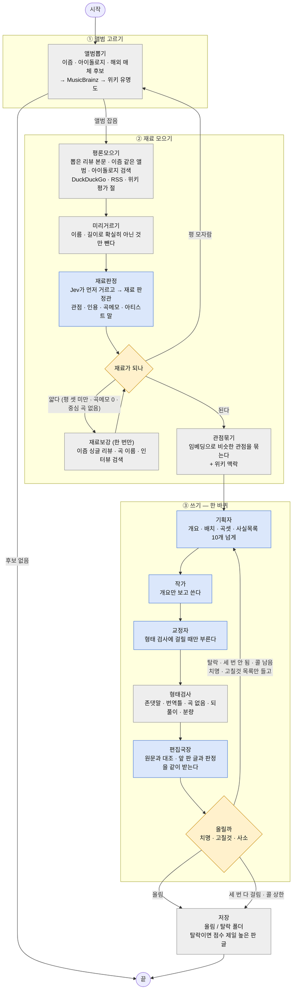
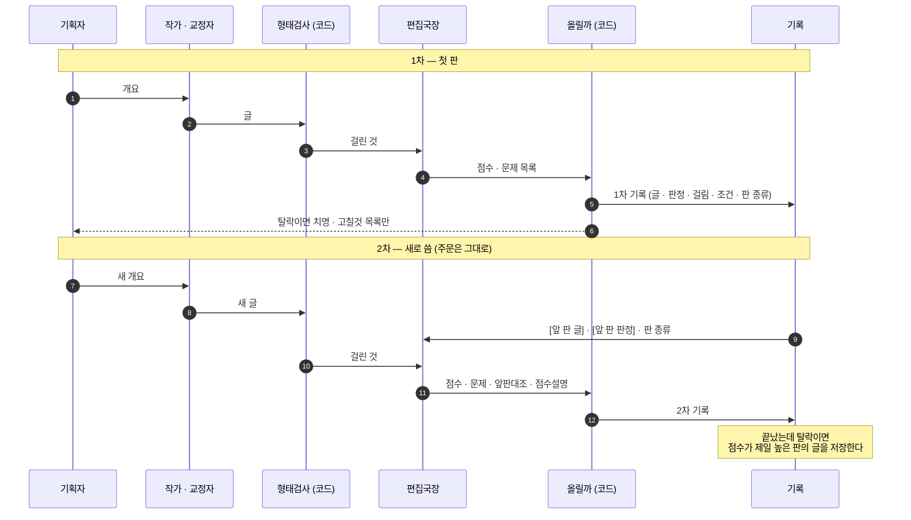
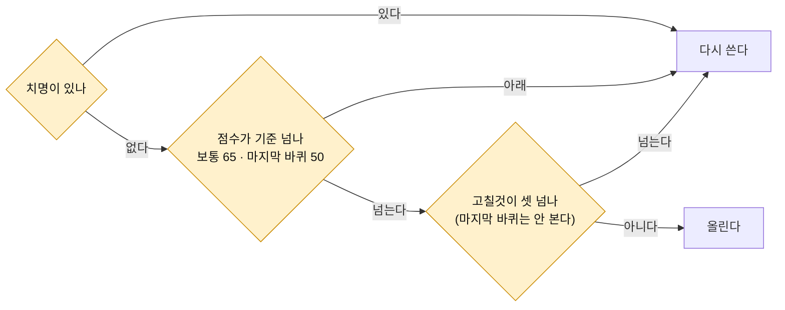
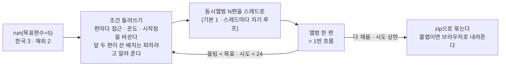

# 음악 리뷰 에이전트 설계도 (v3.5)

기준: `agent/music/music_review_agent.py` v3.5 · 모델 `openai:gpt-6-luna` · 2026-09-27.
코드가 정본이다. 이 문서는 코드를 따라간다. 코드와 다르면 코드를 믿는다.

앨범 하나를 골라 리뷰 한 편을 쓴다. 모양은 상태 하나(`RunState`) · 마디 · 갈림길이다.
마디는 자기 칸만 채우고, 다음에 어디로 갈지는 갈림길 함수가 정한다. LangGraph 라이브러리는 아직 안 쓴다.
옮길 때는 마디를 `add_node`에, 갈림길을 `add_conditional_edges`에 그대로 꽂는다.

---

## 1. 전체 흐름 — 앨범 한 편

파란 칸은 모델을 부르는 마디다. 회색 칸은 코드만 도는 마디다. 노란 칸은 코드가 정하는 갈림길이다.

- 편집국장이 걸면 기획자부터 다시 짠다. 앞 글을 부분 수정하지 않는다. 세 번까지다(`REWRITE_LIMIT`).
- 다시 짤 때 접근 · 온도 · 시작점은 그대로 둔다. 기획자가 받는 것은 지난 문제 목록(치명 · 고칠것)뿐이다. 지난 개요와 지난 글은 안 받는다.
- 기획자 · 작가 호출이 실패하면 한 번 더 부른다(`기획재시도`). 이것은 바퀴로 세지 않는다.
- 평론 원문은 앨범 하나를 만드는 동안 상태에 들고 다닌다. 디스크에는 안 남긴다. 저장 파일에는 관점 · 인용 · 링크만 남는다.

---

## 2. 재료가 어디서 오나

| 단계 | 한국 앨범 | 해외 앨범 |
|---|---|---|
| 후보 | 이즘 국내 앨범 리뷰(무작위 쪽) · 이즘 국내 명반 86 · 아이돌로지 리뷰 | 이즘 해외 명반 322 · 이즘 해외 앨범 리뷰 · 열린 해외 매체 첫 화면(제목파서) |
| 후보 순서 | 이즘 조회수 높은 순 | 같음 |
| 앨범 정보 | MusicBrainz(발매일 · 레이블 · 수록곡 · 별칭). 없으면 매체 정보로 간다 | MusicBrainz |
| 유명도 | 위키백과 아티스트 문서. 이즘 명반이면 문서 없어도 통과 | 위키백과 앨범 문서 |
| 판종 | EP 포함 | EP 제외 |
| 재료 | 뽑은 리뷰 본문 → 이즘 같은 앨범 → 아이돌로지 검색 → DuckDuckGo → RSS → 위키 평가 절 | 같음(아이돌로지 제외) |
| 최소 평 | 1 (`한국최소평`) | 2 (`MIN_REVIEWS`) |

- 나무위키 · 블로그 · 커뮤니티 · 스트리밍 · 가사 사이트는 차단 목록에 있다. robots.txt는 그대로 따른다. 우회 코드는 없다.
- 네이버 검색 API는 AI 이용 금지 약관 때문에 안 쓴다.
- MusicBrainz 점수와 이즘 점수는 안 쓴다. 이즘 조회수는 후보 순서에만 쓴다.

---

## 3. 에이전트 — 모델을 부르는 자리

| 에이전트 | 받는 것 | 내는 것 | 한 편에 부르는 수 |
|---|---|---|---|
| Jev | 페이지 · 편집국장 문제 | 쓸 것 / 버릴 것, 문제 무게. 확신도가 같이 온다 | 페이지 수 · 문제 수. 키가 없으면 스스로 꺼진다 |
| 재료 판정관 | 페이지 한 장 | 다루는 정도 · 평가 있음 · 홍보문 · 관점 · 근거 · 인용 · 곡메모 · 아티스트 말 | Jev가 남긴 페이지 수(최대 10 + 보강 8) |
| 기획자 | 관점표 · 곡메모 · 평론 발췌(편당 1,800자) · 맥락 · 아티스트 말 · 주문 · 지난 문제 | 개요: 주제 · 배치 · 판종처리 · 곡셋 · 곡흐름 · 인용 둘 · 문단 4~6 · 사실목록 | 바퀴마다 1 |
| 작가 | 개요 · 주문 · 표기표 | 제목 · 본문(1,200~2,000자) | 바퀴마다 1 |
| 교정자 | 본문 | 고친 본문 · 고친 곳 | 형태 검사에 걸릴 때만 1 |
| 편집국장 | 원문 · 개요 · 관점표 · 맥락 · 주문 · 표기표 · 앞 판 글 · 앞 판 판정 | 점수 · 문제(사실 / 문장 / 구조) · 한줄평 · 앞판대조 · 점수설명 | 바퀴마다 1 |
| 제목파서 | 해외 매체 리뷰 제목 한 줄 | 아티스트 · 앨범 | 후보 모을 때만 |

- 모든 모델 호출은 앨범 하나에 40번까지다(`LLM_CALL_CAP`). 마디는 60개까지다(`MAX_STEPS`).
- 주문은 접근(분석 · 해석 · 평가) · 온도(건조 · 따뜻함 · 짓궂음) · 시작점(일곱) · 배치(여섯)다. 낱말만 주지 않고 뜻글을 같이 준다. 기획자 · 작가 · 편집국장이 같은 주문을 받는다.
- 배치는 기획자가 재료를 보고 고른다. "곡 순서를 따라간다" 배치만 곡 상한이 없다. 곡 사이 이어짐은 평론에 적힌 것만 쓴다.

---

## 4. 한 바퀴 안 — 편집국장이 앞 판을 기억하는 방식

편집국장은 판마다 처음 보는 것처럼 채점하지 않는다. 두 번째 판부터 앞 판 글과 앞 판 판정을 같이 받는다.
이번 글이 앞 글과 어떻게 다른지를 보고, 점수가 왜 움직였는지를 적는다.

- 앞판대조는 앞 판 문제마다 한 줄이다. "고쳐짐" · "남음" · "새로 생김" · "앞 판에서 못 봄" 넷 중 하나로 적는다.
- "앞 판에서 못 봄"은 앞 판에도 있었는데 그때 안 잡은 문제다. 점수가 내려간 이유가 글 탓인지 편집국장 탓인지를 가르려고 둔다.
- 점수는 앞 점수에서 출발한다. 고쳐진 것이 있고 새 문제가 없으면 앞 점수보다 낮게 주지 않는다. 내리면 점수설명에 이유를 적는다.
- 로그에 `앞 판 62점 → 71점 / 고쳐짐 1 · 남음 1 · 새로 생김 0`이 찍힌다. 저장 파일의 판정 기록에도 같은 줄이 남는다.
- 설정값: `앞판기억`(끄면 판마다 처음 보는 것처럼 본다) · `최고판저장`(끄면 마지막 판을 저장한다).

---

## 5. 올릴지 정하기 — 코드가 정한다

편집국장은 점수와 문제만 낸다. 올릴지는 코드(`올릴까`)가 정한다. 걸린 것을 셋으로 나눈다.

| 무게 | 무엇 | 처리 |
|---|---|---|
| 치명 | 없는 사실 · 지어낸 평(편집국장) · 재료 옮겨 적기 · 없는 다수 평 · 재료 사정 언급 · 정한 곡이 글에 없다 · 곡 이름 없음 · 중심 곡 없음 · 문장 끊김 · 800자 미만 | 다시 쓴다 |
| 고칠것 | 존댓말 · 번역투 틀 · 흐리는 끝맺음 · 괄호 인용 · 긴 인용 · 도메인 · 느낌표 · 부추김 · 추상어 · 영어 원문 · 문장 길이 단조 · 곡 이름으로 문단 열기 · 아티스트 표기 섞임 | 셋 넘으면 다시 쓴다 |
| 사소 | 표기 차이(표기짝 안) · 곡 표기 병기 없음 · 오타 · 문단 시작 반복 · 곡 나열 · 분량 조금 모자람 | 그냥 올린다 |

- 편집국장 문제의 무게는 Jev가 잰다. Jev가 꺼져 있으면 규칙으로 잰다.
- 표기짝(우즈 = WOODZ, 심연 = ABYSS) 안의 표기는 사실 문제로 안 잡는다.

---

## 6. 여러 편 돌리기 — `run()`

- `run_one("우즈", "OO-LI", 곡="Drowning")`은 앨범을 지정한다. 유명도를 안 본다. 곡을 주면 그 곡이 글의 가운데다.
- `점검()` · `뽑기만()`은 모델을 안 부른다. API · 검색 · 매체 · RSS가 살아 있는지, 후보와 재료가 모이는지만 본다.
- 콜랩 노트북은 `agent/py2ipynb.py`로 이 파일에서 뽑는다. 노트북을 손으로 고치지 않는다.

---

## 7. 상한과 주요 설정

| 설정 | 값 | 뜻 |
|---|---|---|
| `목표편수` · `시도상한` | 5 · 24 | 올린 글이 다섯 편 될 때까지. 앨범 24개를 봐도 못 채우면 멈춘다 |
| `KR_RATIO` | 0.5 | 다섯 편이면 한국 3 · 해외 2 |
| `PAGE_LIMIT` · `보강페이지` | 10 · 8 | 앨범 하나에 읽는 페이지 수 |
| `PER_MEDIA` | 2 | 매체당 남기는 평론 수 |
| `REWRITE_LIMIT` | 3 | 다시 쓰기 상한 |
| `PASS_SCORE` · `마지막안전점수` | 65 · 50 | 올림 점수 기준 |
| `LLM_CALL_CAP` · `MAX_STEPS` | 40 · 60 | 앨범 하나에 모델 요청 · 마디 상한 |
| `동시앨범` | 1 | 앨범을 몇 편씩 같이 돌릴지 |
| `앞판기억` · `최고판저장` | True · True | 4번 참고 |
| `조건돌려쓰기` | True | 6번 참고 |
| `콜랩_끝나면zip` | True | 콜랩에서 끝나면 zip을 내려준다 |

---

## 8. 판 이력

| 판 | 날짜 | 바뀐 것 |
|---|---|---|
| v2.5 | 09-20 | 콜랩 노트북을 스크립트로 옮김. 검색 + 차단 목록, RSS, 위키 평가 절 |
| v2.6~2.9 | 09-20~21 | 이즘 · 아이돌로지 API, run_one, 곡 순서 배치, 곡메모 · 아티스트 말, 재료 보강 |
| v3.0~3.3 | 09-21 | 올림 관문 셋(치명 · 고칠것 · 사소), Jev, 재시도, 교정자는 걸릴 때만, 동시앨범, zip 자동 내려받기 |
| v3.4 | 09-22 | 편집국장이 앞 판 글 · 판정을 받는다, 판 종류, 앞 판에서 못 봄, 최고 판 저장 |
| v3.5 | 09-24 | 주문 뜻글, 작가 공통 규칙, 편집국장 되풀이 · 꼴, 표기표 · 표기짝, 조건 돌려쓰기. 모델 gpt-6-luna |

지난 판 파일은 `versions/`에 있다. 판마다 바뀐 것은 `music_review_agent.py` 머리 주석에 있다.

---

## 9. 아직 정하지 않은 것

- 속도: 마디별 시간 로그가 없다. 한 편 3~8분 중 어디에 시간이 드는지 아직 모른다.
- 동시앨범 2 이상은 실제 모델로 아직 안 돌렸다.
- 직접 인용을 뺄지(`이즘은 “…”라고 썼다` 꼴). 저작권 처리 방식이 미결이다.
- 판 사이 점수를 비교하는 판정 로그 파일(jsonl, 프롬프트 판 포함)은 아직 없다. 지금은 저장 파일 안의 판정 기록뿐이다.
- 싱글 리뷰를 다룰지(이즘 싱글 리뷰 3,637건).
- LangGraph로 옮길지.
